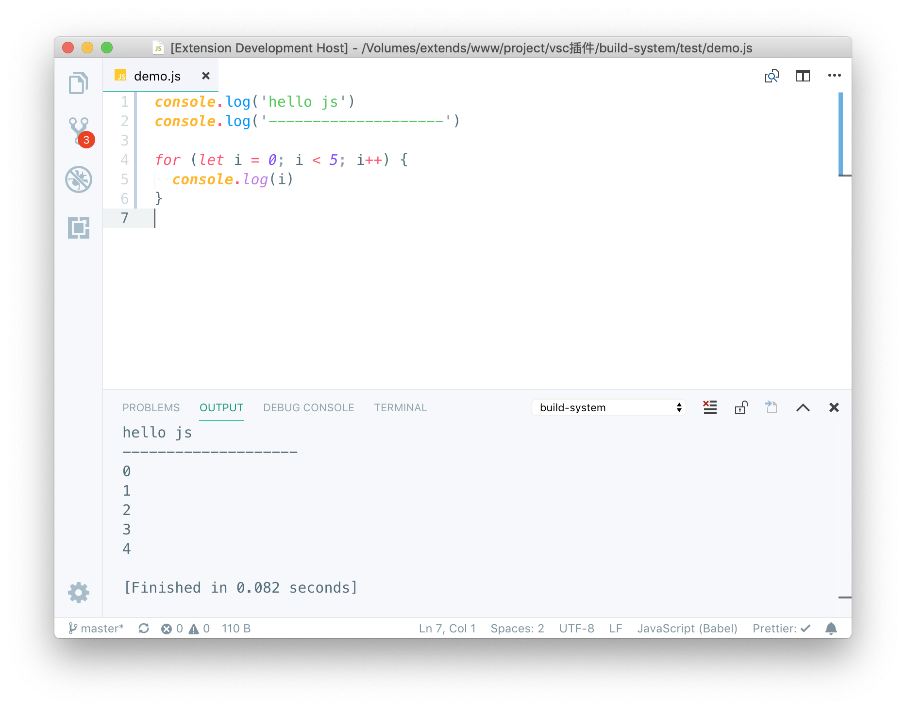

# Build System
> 🔥 类似sublime的Build System功能, 方便快速调试一些代码片断或想法。
>> 目前只支持少数语言的简单编译调试, 因为vscode原则上只是一个编辑器, 我并不希望把它变成一个IDE, 所以暂时并不打算支持那些需要复杂的编译环境及配置的语言。

目前支持的语言有以下:
> - .bat
> - .dart
> - .go
> - .js
> - .json (调用`npm start`来执行)
> - .py
> - .sh
> - .swift
> - .ts (依赖全局安装的`ts-node`模块)
>> 除以上内置的以外, 还支持代码文件内首行以 `#!`开关的环境配置(优先级高于插件内置)

## 兼容性
> 理论上, 兼容Linux/MacOS/Windows, 不过我只在Linux/MacOS下测试过, 用Windows的童鞋请自行测试,有什么问题, 可以提issue。

## 安装
> 直接在商店搜索安装即可。

